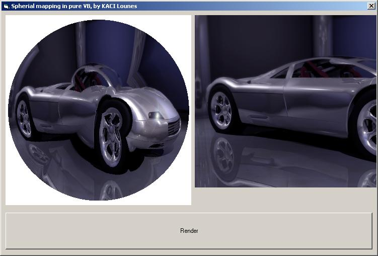



## Spherical mapping, pure VB, by KACI Lounes

### Description

This program allows you how to we can map textures in a 'Spherical deformation', helpful for rendering 3D backgrounds (as cieling) for exemple. include filtering.
 
### More Info
 

             |
---                |---
**Submitted On**   |2002-06-29 22:12:30
**By**             |[KACI   Lounes](https://github.com/Planet-Source-Code/PSCIndex/blob/master/ByAuthor/kaci-lounes.md)
**Level**          |Intermediate
**User Rating**    |5.0 (25 globes from 5 users)
**Compatibility**  |VB 6\.0
**Category**       |[Graphics](https://github.com/Planet-Source-Code/PSCIndex/blob/master/ByCategory/graphics__1-46.md)
**World**          |[Visual Basic](https://github.com/Planet-Source-Code/PSCIndex/blob/master/ByWorld/visual-basic.md)
**Archive File**   |[Spherical\_2003416292006\.zip](https://github.com/Planet-Source-Code/kaci-lounes-spherical-mapping-pure-vb-by-kaci-lounes__1-65807/archive/master.zip)

